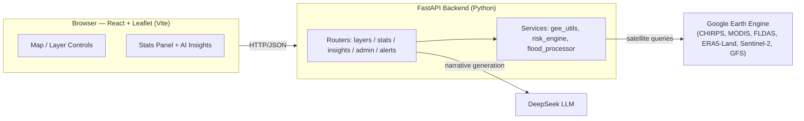

# Sahan — AI Enabled Early Warning System for Somalia

Real-time satellite-driven drought, rainfall, vegetation, soil moisture, and
flash-flood monitoring for Somalia, with AI-generated plain-language
situation briefs for decision-makers. Built for the **IGAD Hackathon 2026**
("Smarter Early Warning, Stronger Communities") — selected as a **Top 10
finalist**, advancing to the physical evaluation workshop at ICPAC, Nairobi.

**Live demo:** https://sahan-somalia-ews.vercel.app
*(backend runs on a free tier and may take 30–60s to wake up on first load)*

## What it does

- Interactive map of Somalia with 10 satellite-derived index layers (NDVI,
  CHIRPS rainfall, SPI, SPEI, SMI, VHI, TCI, BSI, land-surface temperature,
  temperature anomaly) plus a combined drought index (CDI).
- 1/3/7/14-day rainfall and temperature forecasts (NOAA GFS).
- Flash-flood risk overlay combining static terrain/soil/land-cover
  susceptibility with live rainfall forecasts, across 5,000+ river sub-basins.
- Click any point on the map for a 12-month time-series chart of the active
  index, with CSV/JSON export.
- Live water-source monitoring overlay (~1,900 surveyed boreholes, wells,
  dams, berkads and springs) with functioning status and water-quality data.
- AI-generated narrative insights (situation, drivers, impact, risk level,
  recommendations) for any region or district, grounded in the real computed
  indices — see [`docs/METHODOLOGY.md`](docs/METHODOLOGY.md) for exactly how
  each index is calculated and what's disclosed as a simplification, or
  [`docs/SAHAN_TECHNICAL_INSTITUTIONAL_REPORT.md`](docs/SAHAN_TECHNICAL_INSTITUTIONAL_REPORT.md)
  for the full methodology writeup with file/function-level citations.

## Architecture



## Tech stack

| Layer | Technology |
|---|---|
| Backend | Python 3.13, FastAPI, Uvicorn |
| Satellite data | Google Earth Engine (`earthengine-api`) |
| AI narrative engine | DeepSeek (OpenAI-compatible API) |
| Frontend | React 18, Vite, Leaflet (react-leaflet), Recharts |

## Data sources

CHIRPS (rainfall), MODIS (NDVI, land-surface temperature), NASA FLDAS (soil
moisture), ERA5-Land (2m air temperature, potential evapotranspiration),
NOAA GFS (forecasts), Sentinel-2 (bare soil index), FAO GAUL (admin
boundaries), FAO SWALIM (rainfall classification, water source survey data).

## Project structure

```
backend/
  app/
    main.py            # FastAPI app, CORS, startup
    routers/            # health, layers, stats, insights, admin, alerts
    services/            # gee_utils, risk_engine, flood_processor
    core/                 # shared cache, rate limiter, error handling, path anchors
  scripts/               # one-off data preprocessing / verification scripts
  tests/                  # pytest suite (pure-logic modules, no GEE credentials needed)
frontend/
  src/components/        # MapDashboard, Legend, WaterSourceMap, etc.
docs/
  METHODOLOGY.md          # index formulas, ICPAC/WMO alignment notes, disclosures
```

## Setup

### Backend

```bash
cd backend
python -m venv venv
venv\Scripts\activate        # Windows; use `source venv/bin/activate` on macOS/Linux
pip install -r requirements.txt
cp .env.example .env         # fill in DEEPSEEK_API_KEY
# Place your GEE service-account key as gee-key.json at the project root
uvicorn app.main:app --reload --port 8000
```

### Frontend

```bash
cd frontend
npm install
cp .env.example .env          # adjust VITE_API_BASE_URL if not using localhost:8000
npm run dev
```

Or use `start.ps1` / `start.bat` at the project root to launch both at once.

### Tests & linting

```bash
# Backend (no GEE credentials needed — pure-logic tests only)
cd backend
pip install -r requirements-dev.txt
pytest
black --check .
ruff check .

# Frontend
cd frontend
npm run lint
npm run build
```

## Deployment

The live demo runs on Render (backend) and Vercel (frontend). Two env vars
support this without ever committing secrets:

- `GEE_SERVICE_ACCOUNT_JSON` — the full contents of the GEE service-account
  key, pasted as an env var (for hosts where a file can't be uploaded)
- `FRONTEND_ORIGINS` — comma-separated extra CORS origins for the deployed
  frontend domain

See [`backend/.env.example`](backend/.env.example) for details, and
`backend/requirements-runtime.txt` for the trimmed dependency set used in
production (the full `requirements.txt` includes geo-processing libraries
only needed by the one-off flash-flood preprocessing script).

## License

MIT — see [LICENSE](LICENSE).
