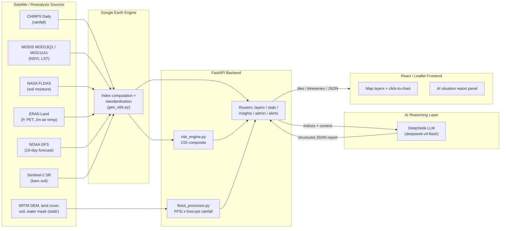

# Sahan: An AI-Enabled Satellite Early Warning Platform for Somalia

**Technical & Institutional Report**
Prepared for: IGAD Hackathon 2026 submission and institutional outreach
Version: 1.0 — July 2026

> **How to read this document.** Every technical claim below is cited to the exact file and function it was pulled from in the current codebase (`f:\Systems\somalia-ews`), so it can be independently verified. Claims I could not confirm directly from the code or from an authoritative external source are explicitly marked **[NEEDS VERIFICATION]**. Where Sahan's methodology is a simplification of, or departure from, a published standard, that is stated plainly rather than implied to be identical.

---

## Table of Contents
1. [Executive Summary](#1-executive-summary)
2. [Purpose & Context](#2-purpose--context)
3. [How It Works — End-to-End Data Flow](#3-how-it-works--end-to-end-data-flow)
4. [Index Methodology](#4-index-methodology)
5. [Alignment with ICPAC and WMO Standards](#5-alignment-with-icpac-and-wmo-standards)
6. [Main Features](#6-main-features)
7. [AI Reasoning Layer](#7-ai-reasoning-layer)
8. [Institutional Value for Somalia](#8-institutional-value-for-somalia)
9. [Technical Architecture](#9-technical-architecture)
10. [Current Status & Roadmap](#10-current-status--roadmap)

---

## 1. Executive Summary

Sahan is a satellite-based early warning platform that monitors drought, flash-flood susceptibility, and vegetation stress across Somalia in near-real time, and turns the resulting satellite indices into plain-language, decision-ready situation reports.

The platform pulls directly from public satellite and reanalysis archives — CHIRPS rainfall, MODIS vegetation and land-surface temperature, NASA FLDAS soil moisture, ECMWF ERA5-Land, NOAA GFS forecasts, and Sentinel-2 — through Google Earth Engine, computes a set of standard remote-sensing drought indices (SPI, VCI/TCI/VHI, a soil-moisture anomaly, and a water-balance anomaly), combines them into a project-specific Combined Drought Index, and separately computes a static Flash Flood Susceptibility Index per river sub-basin that is combined with live rainfall forecasts for dynamic flood alerts. A large-language-model reasoning layer (DeepSeek) then converts these numeric indices into a structured narrative — situation, drivers, impact, risk level, and recommended actions — grounded strictly in the computed values, for any national, regional, or district scope.

The problem this addresses is not a lack of satellite data — CHIRPS, MODIS, and FLDAS are all public and already used by regional monitoring bodies. The problem is *latency and interpretability*: technical index values (an "SPI of ‑1.8," a "VCI of 22%") do not, on their own, tell a district administrator or a field team what to do. Sahan closes that last-mile gap by (a) recomputing the indices continuously rather than waiting on periodic bulletins, and (b) auto-generating the interpretive layer that normally requires a trained analyst.

Sahan is explicit, in its own code and documentation, about where it follows established methodologies exactly (the Kogan VCI/TCI/VHI formulas) and where it deliberately simplifies them for near-real-time computation (its SPI and SPEI use direct Z-score standardization rather than the WMO-recommended gamma/log-logistic distribution fits; its Combined Drought Index is a linear, seasonally-weighted composite, not the categorical ICPAC/JRC-EDO decision tree). Section 5 details each of these alignments and departures explicitly.

---

## 2. Purpose & Context

Somalia's food security and water security are governed almost entirely by two rainy seasons: **Gu** (April–June, the main season) and **Deyr** (October–December, the short season), separated by two dry seasons, **Jilaal** (January–March) and **Xagaa** (July–September) [`backend/app/services/risk_engine.py:20-25`]. A single failed Gu or Deyr season is a known precursor to acute food insecurity; consecutive failed seasons — as happened repeatedly in the 2016–2017 and 2020–2023 droughts — are the standard trigger pattern for famine risk across the Horn of Africa.

Existing regional monitoring infrastructure (ICPAC's East Africa Drought Watch, FEWS NET, SWALIM) already produces SPI, NDVI, and land-surface-temperature bulletins for the region. These are technically sound but face two practical constraints that Sahan is built to address:

1. **Latency.** Regional bulletins are typically produced on a monthly or dekadal cycle and require manual compilation. By the time a bulletin reaches a district office, the underlying satellite data may already be several weeks old.
2. **Technical interpretability.** An SPI value, a VCI percentage, or a soil-moisture anomaly in standard deviations is directly meaningful to a climatologist, but not self-evidently actionable to a district administrator, a WASH field officer, or a local NGO coordinator without a translation layer explaining *why* the number matters and *what* it implies for water points, pasture, or population movement.

Sahan's design directly targets both constraints: indices are recomputed live via Google Earth Engine on every request (subject to the underlying satellite archive's own update cadence, see §4 for cadence per source), and every index bundle can be converted, on demand, into a structured, non-technical narrative report by the AI reasoning layer described in §7.

---

## 3. How It Works — End-to-End Data Flow



Concretely, the pipeline is:

1. **Data acquisition** — Every index-producing function in `backend/app/services/gee_utils.py` opens the relevant Earth Engine `ImageCollection` (e.g. `UCSB-CHG/CHIRPS/DAILY`, `MODIS/061/MOD13Q1`) at request time and filters it to the requested date window and to Somalia's national boundary (`USDOS/LSIB_SIMPLE/2017`) or, for scoped AI-insight queries, to a specific region/district geometry from `FAO/GAUL/2015/level1`/`level2` [`gee_utils.py:1565-1573`].
2. **Index computation & standardization** — Raw bands are converted into the indices described in §4 (SPI, VCI, TCI, VHI, SMI, SPEI, BSI, temperature anomaly), each returned either as a map tile URL (`sanitize_url(image.getMapId(...))`) for the interactive map, or as a scalar/point time series for charts.
3. **Combined Drought Index** — `backend/app/services/risk_engine.py` takes the four normalized stress scores (SPI, VHI, SMI, SPEI) and combines them into a single 0–1 CDI using a seasonally-dependent weight matrix (§4.7).
4. **Flash Flood Susceptibility** — A separate, offline-precomputed static susceptibility score per river sub-basin (`backend/scripts/preprocess_flood_data.py`) is combined at request time with a live 3-day NOAA GFS rainfall forecast per basin (`backend/app/services/flood_processor.py`) to produce a dynamic flood risk layer (§4.8).
5. **AI reasoning** — `backend/app/routers/insights.py` assembles a grounding-data bundle (`get_multi_index_context` / `get_forecast_context` in `gee_utils.py`) containing the real computed index values, the season, and the two most recently completed rainy seasons' performance, and sends it to DeepSeek with a strict prompt (§7) that forces the model to reason only from the supplied numbers and return a fixed JSON schema.
6. **Presentation** — The React/Leaflet frontend renders the map tiles, lets a user click anywhere to get a time-series chart for the active index (`/api/stats/point_v2`), and displays the AI-generated narrative in a side panel, scoped to national/regional/district level (§6).

---

## 4. Index Methodology

All formulas below are transcribed directly from the implementation; file and line references point to `backend/app/services/gee_utils.py` unless stated otherwise.

### 4.1 Standardized Precipitation Index (SPI)

| | |
|---|---|
| **Data source** | CHIRPS Daily (`UCSB-CHG/CHIRPS/DAILY`) |
| **Native resolution / cadence** | ~0.05° (~5.5 km), daily |
| **Climatology baseline** | 1991–2020 |
| **Function** | `get_monthly_anomaly()` [`gee_utils.py:338-382`], `get_spi_layer()` / `get_spi_timeseries()` [`gee_utils.py:993-1040`] |

**Calculation as implemented:** For the target calendar month, CHIRPS is aggregated (summed) to a monthly total for every year 1991–2020, and the standardized anomaly is:

```
SPI = (current_month_total − yearly_mean) / yearly_stdDev
```

where `yearly_mean`/`yearly_stdDev` are computed across the 30-year population of monthly totals for that specific calendar month [`_yearly_climatology_stats()`, `gee_utils.py:316-335`]. The standard deviation is floored at 0.5 mm to avoid division blow-up in extremely arid cells [`gee_utils.py:373-374`]. This is a **Z-score anomaly**, not a gamma-distribution-fitted SPI (see §5.1 for the distinction).

For the Combined Drought Index, an **SPI‑3** (3-month rolling) is used: the current and two preceding monthly anomalies are summed and divided by √3 [`gee_utils.py:521-530`].

**Classification (as used in the AI narrative text layer, not the map)** [`insights.py:300-323`]:

| SPI range | Category |
|---|---|
| ≤ −2.0 | Extremely below normal |
| −2.0 to −1.5 | Severely below normal |
| −1.5 to −1.0 | Moderately below normal |
| −1.0 to −0.5 | Slightly below normal |
| −0.5 to 0.5 | Near-normal |
| 0.5 to 1.0 | Slightly above normal |
| > 1.0 | Well above normal |

**Aggregation to district level:** mean `reduceRegion`/`reduceRegions` over the FAO GAUL level-2 district geometry, 5 km reducer scale [e.g. `gee_utils.py:1600-1606`, `1487`].

### 4.2 Vegetation Condition Index (VCI), Temperature Condition Index (TCI), Vegetation Health Index (VHI)

| | |
|---|---|
| **Data source** | MODIS MOD13Q1 (NDVI) for VCI; MODIS MOD11A1 (LST_Day_1km) for TCI |
| **Native resolution / cadence** | NDVI: 250 m, 16-day composite. LST: ~1 km, daily |
| **Climatology baseline** | Full MODIS archive, 2000–present, per calendar month |
| **Function** | `get_vci_image()` [`gee_utils.py:441-467`], `get_tci_image()` [`gee_utils.py:470-497`], `get_vhi_layer()` [`gee_utils.py:1043-1118`] |

**Formulas (Kogan, 1995/1997 — implemented exactly as published):**

```
VCI = 100 × (NDVI − NDVI_min) / (NDVI_max − NDVI_min)
TCI = 100 × (LST_max − LST) / (LST_max − LST_min)
VHI = 0.5 × VCI + 0.5 × TCI
```

`NDVI_min`/`NDVI_max` and `LST_min`/`LST_max` are the historical minimum and maximum for that specific calendar month across the full MODIS archive, computed via `ee.Reducer.minMax()` over all same-month images [`gee_utils.py:447-448, 475-476`]. Low VCI/high LST → low TCI both indicate stress; VHI is Kogan's equal-weighted average of the two.

**Classification** (used in the AI text layer) [`insights.py:325-362`]:

| VCI | Category | | TCI | Category |
|---|---|---|---|---|
| < 10% | Extreme vegetation stress | | < 20% | Extreme heat stress |
| 10–25% | Severe vegetation stress | | 20–35% | High heat stress |
| 25–40% | Moderate vegetation stress | | 35–50% | Moderate heat |
| 40–60% | Near-normal vegetation | | ≥ 50% | Normal temperature range |
| ≥ 60% | Good / healthy vegetation | | | |

### 4.3 Land Surface Temperature (LST) and Temperature Anomaly

| | |
|---|---|
| **Data source** | MODIS MOD11A1 (`LST_Day_1km`) |
| **Native resolution / cadence** | ~1 km, daily |
| **Unit conversion** | `°C = raw × 0.02 − 273.15` [`gee_utils.py:833, 917`] |
| **Anomaly climatology** | 2000–present, per calendar month [`get_temp_anomaly_layer()`, `gee_utils.py:1189-1212`] |

The temperature anomaly layer is a standardized Z-score anomaly of LST against the full-archive same-month population, using the same `get_monthly_anomaly()` machinery as SPI.

### 4.4 Soil Moisture Index (SMI)

| | |
|---|---|
| **Data source** | NASA FLDAS (`NASA/FLDAS/NOAH01/C/GL/M/V001`), band `SoilMoi00_10cm_tavg` |
| **Native resolution / cadence** | ~0.1° (~11 km), monthly |
| **Climatology baseline** | 1982–present |
| **Function** | `get_smi_layer()` / `get_smi_timeseries()` [`gee_utils.py:869-892, 966-990`] |

Calculated identically to SPI's method (standardized anomaly against a yearly, same-calendar-month population), with the standard deviation floored at 0.01 [`gee_utils.py:376`]. Represents 0–10 cm top-layer soil moisture, expressed as a standard-deviation anomaly (negative = deficit).

### 4.5 Standardized Precipitation-Evapotranspiration Index (SPEI)

| | |
|---|---|
| **Data source** | ERA5-Land Daily Aggregates (`ECMWF/ERA5_LAND/DAILY_AGGR`), bands `total_precipitation_sum` and `potential_evaporation_sum` |
| **Native resolution / cadence** | ~0.1° (~11 km), daily, aggregated monthly |
| **Climatology baseline** | 1991–2020 |
| **Function** | `get_water_balance_anomaly()` / `_monthly_water_balance()` [`gee_utils.py:385-438`] |

**Calculation as implemented:** a genuine water-balance term `D = Precipitation − Potential Evapotranspiration` is computed monthly (ERA5-Land's `potential_evaporation_sum` is already a physically-based PET estimate, output in negative/upward-flux convention, so `D = precip_mm + pet_sum_mm` is algebraically `P − PET`) [`gee_utils.py:385-394`]. `D` is then standardized the same way as SPI/SMI (Z-score against the yearly same-month population), with the standard deviation floored at 5 mm [`gee_utils.py:432-434`]. Because PET comes from ERA5-Land directly rather than a hand-rolled Hargreaves/Thornthwaite approximation, this is a genuine water-balance index, not a rainfall-only proxy relabeled as SPEI.

### 4.6 Bare Soil Index (BSI)

| | |
|---|---|
| **Data source** | Sentinel-2 Surface Reflectance Harmonized (`COPERNICUS/S2_SR_HARMONIZED`), bands B2/B4/B8/B11 |
| **Native resolution / cadence** | 10–20 m; monthly median composite |
| **Cloud masking** | Scene Classification Layer (SCL): shadow/cloud/cirrus classes 3, 8, 9, 10 excluded [`mask_s2_clouds()`, `gee_utils.py:1332-1337`] |
| **Function** | `get_bsi_layer()` / `get_bsi_timeseries()` [`gee_utils.py:1340-1428`] |

```
BSI = ((SWIR + Red) − (NIR + Blue)) / ((SWIR + Red) + (NIR + Blue))
```

masked to pixels with Sentinel-2-derived NDVI < 0.35 (non-vegetated) to focus on genuine bare/degraded ground rather than vegetated land [`gee_utils.py:1374-1376`].

### 4.7 Combined Drought Index (CDI) — Sahan's own composite

| | |
|---|---|
| **Inputs** | Normalized SPI, VHI, SMI, SPEI stress scores (each 0.0 = no stress, 1.0 = extreme stress) |
| **Function** | `backend/app/services/risk_engine.py` — `compute_cdi()` / `gee_compute_cdi()` [`risk_engine.py:100-188`] |
| **District aggregation** | `get_drought_stats()` [`gee_utils.py:1431-1554`] — mean over FAO GAUL level-2 districts, 5 km scale |

**Normalization of each sub-index to a 0–1 stress score** [`risk_engine.py:69-95`]:

```
SPI_stress  = |clamp(SPI, −3, 0)| / 3
VHI_stress  = clamp(1 − VHI/100, 0, 1)
SMI_stress  = |clamp(SMI, −3, 0)| / 3
SPEI_stress = |clamp(SPEI, −3, 0)| / 3
```

**Seasonal weighting** — Somalia's four-season calendar (Jilaal/Gu/Xagaa/Deyr) determines which weight matrix applies [`risk_engine.py:20-32`]:

| Season type | Months | SPI | VHI | SMI | SPEI |
|---|---|---|---|---|---|
| Rainy (Gu, Deyr) | Apr–Jun, Oct–Dec | 30% | 25% | 20% | 25% |
| Dry (Jilaal, Xagaa) | Jan–Mar, Jul–Sep | 50% | 35% | 15% | 0% |

```
CDI = w_SPI × SPI_stress + w_VHI × VHI_stress + w_SMI × SMI_stress + w_SPEI × SPEI_stress
```
clamped to [0, 1] and rounded to 4 decimal places [`risk_engine.py:100-112`].

**Classification thresholds** [`risk_engine.py:38-44`]:

| CDI score | Category | Color |
|---|---|---|
| 0.00 – 0.20 | Normal | `#05e100` |
| 0.20 – 0.40 | Watch | `#ffff00` |
| 0.40 – 0.60 | Moderate | `#ff9900` |
| 0.60 – 0.80 | Severe | `#ff0000` |
| 0.80 – 1.00 | Extreme | `#990000` |

> **Disclosure, verbatim from the code's own module docstring** [`risk_engine.py:1-15`]: *"The CDI computed here is a simplified linear composite (seasonally-weighted sum of normalized SPI/VHI/SMI/SPEI stress)... It is inspired by, but is NOT the same as, the published ICPAC/JRC-EDO Combined Drought Indicator methodology... The specific seasonal weights below are this project's own calibration and have not yet been externally validated against an ICPAC reference dataset."* This report treats that disclosure as authoritative — see §5.4 for exactly how the two methods differ.

**Current limitation** [NEEDS VERIFICATION against latest frontend build]: the CDI map layer and its `/api/layers/cdi` endpoint are fully implemented server-side, and CDI is the default `layer` value for AI-insight requests, but as of this report the Sidebar UI (`frontend/src/components/Sidebar.jsx`) has no radio button that sets the map's active layer to `cdi` — it is reachable via the AI insights panel and via a direct `/api/stats/point_v2?type=cdi` query, but not by direct map-layer selection. This is a one-line frontend fix, not a backend gap.

### 4.8 Flash Flood Susceptibility Index (FFSI) and dynamic flood risk

The FFSI is a **static, offline-precomputed structural susceptibility score**, separate from the dynamic weather-driven layers above.

| | |
|---|---|
| **Basin units** | 5,182 sub-catchment polygons (HydroBASINS-style delineation — `HYBAS_ID`/`PFAF_ID` fields present in the data) [NEEDS VERIFICATION: exact HydroBASINS version/Pfafstetter level not stated in code] |
| **Script** | `backend/scripts/preprocess_flood_data.py` |
| **Output** | `flash floods base data/somalia_basins_ffsi.geojson` |

**Inputs, per basin (zonal mean via `rasterstats.zonal_stats`):**

| Layer | Source | Processing |
|---|---|---|
| Slope | SRTM 30 m DEM | `arctan(sqrt(dx²+dy²)) × 180/π` via `numpy.gradient` [`preprocess_flood_data.py:16-20`] |
| Land-cover runoff potential | 10 m land-cover raster | Mapped to a runoff coefficient per class: 0.1 (class 10) up to 1.0 (class 80 — permanent water/impervious); intermediate classes 0.3–0.9 [`preprocess_flood_data.py:66-73`] |
| Soil infiltration capacity | Static soil-infiltration raster | Used inverted (low infiltration → high susceptibility) |
| Water-mask / TWI proxy | Static water-mask raster | Used as a topographic-wetness-index proxy |

**Formula** [`preprocess_flood_data.py:115-129`], each term min-max normalized across all basins:

```
FFSI = 0.4 × slope_norm + 0.3 × (1 − soil_infiltration_norm) + 0.2 × landcover_runoff_norm + 0.1 × water_mask_norm
```

This is computed once, offline, and stored per basin — it does not change with weather.

**Dynamic risk (combines static FFSI with live rainfall forecast)** [`backend/app/services/flood_processor.py`, `get_flood_alerts()`, lines 23-91]:

```
risk_score = FFSI × forecasted_3-day_basin_mean_rainfall_mm   (NOAA GFS, via get_basin_rainfall())
```

| risk_score | Status |
|---|---|
| > 2 × threshold (default threshold = 50, so > 100) | High |
| > threshold (> 50) | Moderate |
| otherwise | Low |

[NEEDS VERIFICATION / explicit disclosure]: this is a simple multiplicative heuristic (static susceptibility × forecast rainfall depth), not a calibrated or peer-reviewed hydrological flash-flood forecasting model (e.g. it does not route flow between basins, model channel capacity, or account for antecedent soil saturation beyond what SMI/SPEI capture separately). It should be presented to institutional partners as a first-pass susceptibility screening tool, not a hydraulic flood-forecast model.

---

## 5. Alignment with ICPAC and WMO Standards

This section states explicitly, index by index, where Sahan follows a published standard and where — and why — it departs from one.

### 5.1 SPI vs. WMO-No. 1090

WMO's official guidance (*Standardized Precipitation Index User Guide*, WMO-No. 1090, Svoboda, Hayes & Wood, 2012, based on McKee, Doesken & Kleist, 1993) specifies fitting a **gamma distribution** to the precipitation aggregate for the target accumulation period, then transforming the cumulative probability to a standard normal (Z) quantile via the inverse normal CDF.

Sahan's `get_monthly_anomaly()` instead computes a **direct Z-score** — `(value − mean) / stdDev` — against the same-calendar-month population, assuming approximate normality of the monthly aggregate rather than fitting a gamma distribution [`gee_utils.py:338-382`].

**Practical consequence:** the two methods agree closely near the center of the distribution (near-normal rainfall) but diverge in the tails. Because monthly precipitation is typically right-skewed (bounded at zero, with a long wet tail), a raw Z-score can understate how extreme a dry month statistically is compared to a properly gamma-fitted SPI, and can behave asymmetrically between dry and wet extremes. Sahan discloses this in its own module docstrings and this report carries that disclosure forward rather than presenting its SPI as WMO-standard.

### 5.2 SPEI vs. Vicente-Serrano et al. (2010)

The SPEI's original formulation (Vicente-Serrano, Beguería & López-Moreno, 2010) computes the water balance `D = P − PET`, accumulates it at the desired timescale, and fits the resulting series to a **three-parameter log-logistic distribution** (via probability-weighted moments) before standardizing.

Sahan computes the same underlying water-balance term `D` — and does so with a genuine, physically-based PET (ERA5-Land's `potential_evaporation_sum`), which is a meaningful strength — but then standardizes `D` with a direct Z-score against the yearly same-month population, the same simplification as §5.1, rather than fitting the log-logistic distribution [`gee_utils.py:385-438`]. So Sahan's "SPEI" is best described as a **standardized water-balance anomaly**, methodologically closer to true SPEI than a rainfall-only proxy would be (many lightweight implementations skip PET entirely), but not a distributional match to the published SPEI algorithm.

### 5.3 VCI / TCI / VHI vs. Kogan (1995, 1997)

This is the one place Sahan's formulas match the literature standard **exactly**: min-max normalization of NDVI (VCI) and inverted min-max normalization of LST (TCI) against the historical same-calendar-month range, combined as an equal-weighted average for VHI [`gee_utils.py:441-497, 1043-1118`]. No simplification is made here.

### 5.4 Combined Drought Index vs. ICPAC/JRC-EDO Combined Drought Indicator

ICPAC's East Africa Drought Watch Combined Drought Indicator is adapted from the European Drought Observatory's methodology (Sepulcre-Cantó et al., 2012, *Natural Hazards and Earth System Sciences*; revised as CDIv3 in 2023). Published descriptions of that method characterize it as a **categorical, cause-effect decision tree**: a precipitation deficit (SPI-based) is classified as a **Watch**; if a vegetation-productivity anomaly (fAPAR-based) also appears, conditions escalate to a **Warning** (Alert type 1); if a soil-moisture deficit anomaly also appears, conditions escalate to an **Alert** (Alert type 2) — modeling the physical cause-effect chain from rainfall deficit through soil-moisture depletion to reduced vegetation productivity. [NEEDS VERIFICATION: the exact numeric thresholds used at each decision-tree stage were not extractable from the primary PDF in this research pass and should be confirmed against ICPAC/JRC-EDO's current technical documentation, e.g. by contacting ICPAC directly, before this comparison is used in a formal institutional submission.]

Sahan's CDI is structurally different: it is a **linear weighted sum** of four normalized stress scores (SPI, VHI, SMI, SPEI), not a categorical decision tree, and it uses different sub-indices (VHI and SPEI rather than fAPAR and pF soil-moisture potential). This is disclosed directly in Sahan's own code (§4.7) and is the single largest methodological departure in the platform. The seasonal reweighting (dry-season SPEI weight of zero, for example) is Sahan's own adaptation to Somalia's bimodal rainfall calendar and is not drawn from ICPAC's published methodology at all.

**Why this adaptation was made:** a linear composite is computationally trivial to evaluate per pixel across a whole country in near-real time via Earth Engine, whereas a categorical decision tree over four physically-chained conditions is harder to vectorize efficiently at national scale and to keep continuously responsive. This is a legitimate engineering trade-off for a near-real-time monitoring tool, but it means Sahan's CDI **values and categories are not numerically comparable to ICPAC's published CDI** for the same location and date, even though both are called "Combined Drought Index." Any institutional user cross-referencing Sahan against ICPAC's East Africa Drought Watch should treat them as two independent assessments, not two measurements of the same quantity.

### 5.5 Administrative boundaries

Region- and district-scoped queries (AI insights, district-level CDI aggregation) use **FAO GAUL 2015** level-1 (region) and level-2 (district) `FeatureCollection`s directly from Earth Engine [`gee_utils.py:1484-1486, 1568-1573`]. The frontend's map overlay polygons (Somalia Regions / Districts / Settlements layers) use a separately maintained local dataset (`frontend/src/data/maps/sm-admin-all.json`, `Districts.json`, `Settlements.json`) containing Somalia's 18 standard regions and 74 districts — confirmed by direct enumeration of the GeoJSON properties. [NEEDS VERIFICATION: the exact provenance/vintage of this local frontend boundary file relative to FAO GAUL 2015 was not confirmed from the code and should be checked before stating the two are identical.]

### 5.6 Seasonal calendar

The Jilaal/Gu/Xagaa/Deyr four-season calendar used throughout the platform [`risk_engine.py:20-25`] reflects the standard, widely-used Horn of Africa/Somalia seasonal calendar (as used by FEWS NET, SWALIM, and ICPAC) — this is a correct representation of established regional convention, not a Sahan-specific invention. What *is* Sahan-specific is using that calendar to reweight the CDI composite (§5.4).

---

## 6. Main Features

| Feature | Description | Source |
|---|---|---|
| **Interactive multi-layer map** | Three basemaps (OpenStreetMap, CartoDB Light, Esri Satellite) with 10 selectable thematic overlays in the Monitor tab: Rainfall, SPI, SPEI, NDVI, VHI, Land Surface Temperature, Temperature Anomaly, TCI, Soil Moisture Index, Bare Soil Index. (CDI is computed and available but not yet wired to a Sidebar toggle — see §4.7.) | `frontend/src/components/Sidebar.jsx`, `MapView.jsx` |
| **Forecast mode** | Switches to NOAA GFS rainfall/temperature forecast tiles with a 1/3/7/14-day selector. | `Sidebar.jsx`, `/api/layers/forecast` |
| **Time-slicing** | Year (2000–present) and month selectors for the Monitor tab, driving every layer's query window. | `Sidebar.jsx` |
| **Click-to-analyze** | Clicking anywhere on the map fetches a time-series for the active index at that point and renders a trend chart (bar for rainfall/forecast rainfall, multi-line for CDI's SPI/SMDI components, min/avg/max lines for temperature, single line otherwise) plus a tabular data view. | `MapView.jsx` (`MapEvents`), `BottomStatsPanel.jsx`, `/api/stats/point_v2` |
| **Data export** | CSV download, JSON download, and copy-to-clipboard for the currently displayed point time series. | `hooks/useMapStats.js` |
| **Boundary & settlement overlays** | Toggleable Somalia Regions (18), Districts (74), and Settlements layers, rendered from local GeoJSON with label placement (including hand-calibrated label positions for regions/districts whose polygon centroid falls outside the visible landmass, e.g. coastal or irregularly shaped districts). | `MapView.jsx` (`REGION_LABEL_COORDS`, `DISTRICT_LABEL_COORDS`) |
| **Water-source monitoring overlay** | Clustered markers for surveyed water points (boreholes, dug wells, dams, berkads, springs) from a SWALIM-style field survey, color-coded by functioning status (working/broken/abandoned) and shaped by source type, with a popup showing capacity, yield, depth, static water level, water-quality parameters (temperature, pH, EC, TDS), cost, and inspecting agency. | `WaterSourceMap.jsx`, `backend/water_sources.csv` (1,907 surveyed points), `/api/water-sources` |
| **Flash flood risk overlay** | Basin polygons colored by dynamic risk status (High/Moderate; Low-risk basins are filtered out of the rendered layer), with a tooltip showing current forecast rainfall, static susceptibility, and combined risk score. | `MapView.jsx`, `/api/layers/flash-flood-basins`, `/api/alerts/flash-flood` |
| **AI situation reports** | On-demand, scope-selectable (National / Region / District) narrative report combining a plain-language situation summary, drivers, real-world impacts, a risk-level rating, and recommended actions, plus four supporting 12-month trend charts (rainfall anomaly, vegetation health, soil moisture, water-balance anomaly) for historical queries, or a forecast-specific summary and two 16-day forecast charts for forecast queries. | `RightPanel.jsx`, `hooks/useAiInsights.js`, `/api/insights/analyze` |
| **Legend** | Layer-specific gradient or discrete-class legend that updates with the active base layer and active overlays, including an inline disclosure note on the CDI legend that it is an "ICPAC-inspired simplified composite... not the official ICPAC/JRC-EDO categorical methodology." | `Legend.jsx` |

**Not currently implemented** (removed during this development cycle, or never built): a PDF situation-report export was previously implemented (client-side, via `jsPDF`/`html2canvas`, capturing a screenshot of the map into a generated PDF) but has been **removed from the codebase** as of this report, because it produced a screenshot-only document without the AI narrative content and was judged not meaningfully useful. There is currently no export path that combines the AI-generated narrative report itself into a downloadable document — this is listed as a roadmap item in §10.

---

## 7. AI Reasoning Layer

### 7.1 What is passed to the model

`backend/app/routers/insights.py` builds a grounding-data object before calling the LLM, using two different context builders in `gee_utils.py` depending on query type:

- **Historical/index queries** — `get_multi_index_context()` [`gee_utils.py:1557-1844`] assembles: current SPI, VCI, TCI, VHI, soil moisture anomaly, SPEI, the resulting CDI and its seasonal weights, a 3-month SPI trend classification (improving/worsening/stable), and — critically — the performance of the **two most recently completed rainy seasons** (e.g. "Deyr 2025" and "Gu 2025"), each expressed as a mean SPI and a below/above/near-normal label [`gee_utils.py:1609-1689`].
- **Forecast queries** — `get_forecast_context()` [`gee_utils.py:1847-1947`] assembles 1/3/7/14-day cumulative rainfall and average temperature forecasts (NOAA GFS), the most recent observed SPI, and a 20-year (2001–2020) ERA5-Land 2 m air-temperature climatological baseline for the same month — explicitly *not* MODIS LST, because LST is a surface (not air) temperature and can run 15–20 °C hotter, which would make any temperature-anomaly comparison meaningless [`gee_utils.py:1922-1926`].

### 7.2 Prompt rules and guardrails against hallucination

Rather than a single generic prompt, `insights.py` constructs a detailed, rule-based prompt for each of the two query types. The historical-query prompt [`insights.py:522-668`] enforces, verbatim:

1. Always use long-term climatology (minimum 20–30 years) as the primary performance baseline.
2. Always treat the previous 1–2 completed rainy seasons as **primary drivers** of current conditions — if a prior season failed, the model must explicitly name that as a foundational cause of current stress, not just describe the present snapshot in isolation.
3. Ban vague hedging language ("slightly dry") when the underlying anomaly is large.
4. Require internal consistency — the narrative may not contradict the supplied data.
5. Enforce a fixed reasoning structure: situation → drivers → impact → risk level → recommendations → a confidence note.
6. **Ban raw technical index names** (SPI, NDVI, VCI, TCI, CDI) from the output entirely — the system prompt reinforces this a second time [`insights.py:676-682`] — forcing the model to translate every number into plain-language meaning rather than quoting jargon.
7. Scale explanation to geography: region-level queries must name the districts within that region and how conditions may vary across them; district-level queries must reference likely impacts on named settlements.

The forecast-query prompt [`insights.py:69-199`] enforces an equivalent but forecast-specific rule set (FAO SWALIM reporting style, explicit citation of "NOAA-NCEP GFS model" as the data source, and — importantly — a rule that the model must compare the forecast temperature against the supplied ERA5 climatological mean rather than citing a raw forecast temperature as evidence of heat stress on its own [`insights.py:137-145`]).

### 7.3 Model, determinism, and output enforcement

- **Model:** `deepseek-v4-flash`, called via an OpenAI-compatible client against `https://api.deepseek.com` [`insights.py:51-55, 201-202, 672-673`]. [NEEDS VERIFICATION: this exact model identifier should be re-confirmed against DeepSeek's current published model catalog before institutional distribution, since provider model names and availability change over time.]
- **Temperature:** `0.2` for both prompt paths — a low sampling temperature chosen explicitly to reduce output variance and hallucination risk, per the inline comment "Lower temp → more consistent, less hallucination" [`insights.py:687`].
- **Output schema enforcement:** the API call requests `response_format={"type": "json_object"}` (provider-level JSON-mode enforcement), and the code additionally strips Markdown code fences defensively before parsing, as a second line of defense [`insights.py:216-221, 694-699`].
- **Fixed schema, historical:** `situation`, `drivers[]`, `impact[]`, `risk_level` (Normal / Watch / Moderate / Severe), `recommendations[]`, `confidence_note`.
- **Fixed schema, forecast:** `summary`, `key_insights[]`, `risk_levels{drought, flood, heat_stress, water_availability}`, `trend_analysis{rainfall, temperature}`, `early_warnings[]`.

**Guardrail gap, stated plainly:** there is currently **no human-expert review or approval step** in the pipeline — a generated report is returned directly to the end user with no human-in-the-loop check. The only safeguards against a wrong or misleading report are the prompt rules above, the low temperature setting, the enforced JSON schema, and the fact that every number the model reasons over is a real computed satellite index rather than a model guess. This is an accurate limitation, not a hidden one, and is listed as a roadmap item in §10.

One further, minor, verified inconsistency: the historical schema's `risk_level` enum (Normal/Watch/Moderate/Severe) omits the "Extreme" category that `risk_engine.classify_cdi()` itself defines (§4.7) — and the generated `confidence_note` field, while part of the schema, is not currently rendered anywhere in the frontend's AI insights panel [confirmed by direct search of `RightPanel.jsx`].

### 7.4 Caching and cost control

Generated reports are cached for 6 hours per `(scope_level, scope_name, layer)` key, in an in-memory LRU-style cache capped at 500 entries [`backend/app/core/cache.py:15-41`], and insight requests are rate-limited to 10 per 60 seconds per client IP [`cache.py:44-65`], both to bound DeepSeek API spend and to keep response latency low for repeated queries against the same scope.

---

## 8. Institutional Value for Somalia

| Stakeholder | What they get from Sahan | Decision it supports |
|---|---|---|
| **Somalia's National Early Warning Unit** | A continuously updated, national-to-district view of drought severity (CDI) and its component drivers, plus an automatically generated situation narrative that can be issued or adapted directly rather than compiled by hand from raw satellite bulletins. | Prioritizing which regions/districts warrant an escalated monitoring or response posture, and drafting early-warning bulletins faster than a fully manual compilation process allows. |
| **SWALIM / FAO field teams** | A live water-source inventory overlay (functioning status, yield, water quality) cross-referenced against the same drought layers, so degrading water-point conditions can be viewed alongside the rainfall/vegetation context that likely explains them. | Targeting which water points need inspection, rehabilitation, or trucked-water contingency planning first. |
| **WFP, UNICEF, OCHA (humanitarian response planning)** | District-level CDI hotspot ranking (`get_drought_stats()`'s `hotspots` list, §4.7) and scope-specific AI situation reports that translate satellite indices into the kind of plain-language driver/impact/recommendation format used in humanitarian situation reports. | Geographic prioritization of assessment missions and resource pre-positioning, using a consistent, repeatable satellite-derived signal rather than solely relying on field reports that lag actual conditions. |
| **Local/district administrators without a GIS background** | No GIS or remote-sensing expertise is required: the interface is a standard web map with plain-language AI narratives, explicit bans on jargon in the AI output (§7.2), and district-specific settlement-level framing when a district scope is selected. | Understanding, without technical training, whether their district's current conditions warrant local action (e.g. water rationing planning, livestock movement advisories) and why. |

---

## 9. Technical Architecture

| Layer | Technology | Notes |
|---|---|---|
| Backend | Python 3.13, FastAPI (`~0.128`), Uvicorn (`~0.40`) | `backend/requirements.txt`; entrypoint `backend/app/main.py` |
| Satellite/geospatial engine | Google Earth Engine (`earthengine-api ~1.7`), authenticated via a service-account key (`gee-key.json`, auto-discovered at project root or `backend/`, never committed) | `app/services/gee_utils.py:get_key_path()`, `init_gee()` |
| AI reasoning | DeepSeek, via the `openai` Python SDK pointed at DeepSeek's OpenAI-compatible endpoint | `app/routers/insights.py` |
| Geospatial preprocessing (offline) | `geopandas`, `rasterio`, `rasterstats`, `numpy` | `backend/scripts/preprocess_flood_data.py` — run once, not at request time |
| Frontend | React 18.2, Vite, Leaflet 1.9 / react-leaflet 4.2, Recharts 3.6, axios | `frontend/package.json` |
| Backend structure | Routers (`health`, `layers`, `stats`, `insights`, `admin`, `alerts`) → Services (`gee_utils`, `risk_engine`, `flood_processor`) → Core (`cache`, `errors`, `paths`) | `backend/app/` |
| Testing | `pytest` — 58 tests covering the pure-logic modules (`risk_engine.py`'s normalization/CDI/classification/trend functions, and the cache/rate-limiter) with no GEE credentials required | `backend/tests/test_risk_engine.py`, `test_cache.py` |
| CI | GitHub Actions: backend job runs `pytest`, `black --check`, `ruff check` on Python 3.13; frontend job runs `npm ci`, `eslint`, `vite build` | `.github/workflows/backend-tests.yml`, `frontend-build.yml` |

**Caching & cost approach:** two independent caching layers exist — the Earth Engine tile layer itself is inherently cacheable by the browser/CDN via its tile URL scheme, and the AI-insight layer has its own explicit 6-hour TTL cache (§7.4) specifically to control DeepSeek API cost, since identical scope+layer queries within that window are served from memory rather than re-invoking the model.

**Deployment status** [NEEDS VERIFICATION — current as of this report, may change]: CORS is currently configured for local development origins only (`http://localhost:5173/5174/5175`) [`app/main.py:24-28`], and no containerization (Dockerfile/docker-compose) or production hosting configuration exists in the repository — only local dev-launch scripts (`start.ps1`/`start.bat`). Sahan is, as of this report, a fully functional local/dev-deployed system that has not yet been configured for a public production host.

---

## 10. Current Status & Roadmap

### Built and verified
- All eight satellite-derived index layers (rainfall, SPI, VHI/VCI/TCI, temperature/temperature anomaly, SMI, SPEI, BSI) computing and rendering as live GEE map tiles.
- Combined Drought Index computation (national and district-aggregated) with seasonal reweighting.
- Flash Flood Susceptibility Index (static, 5,182 basins) combined with live GFS forecast rainfall for dynamic basin-level risk.
- AI narrative report generation for both historical and forecast queries, at national/region/district scope, with caching and rate-limiting.
- Click-to-chart point time series with CSV/JSON export.
- Water-source survey overlay (1,907 points) with functioning-status and water-quality detail.
- A 58-test pure-logic backend test suite (no GEE credentials required) and CI workflows for both backend and frontend.

### Validated
- The CDI's seasonal weight matrices sum to 1.0 in both season types (verified by unit test, `tests/test_risk_engine.py`).
- Classification threshold boundaries for CDI severity categories (unit-tested at each boundary value).
- Cache TTL/eviction and rate-limiter windowing behavior (unit-tested).
- [NEEDS VERIFICATION]: none of Sahan's index outputs have yet been validated against ICPAC's own published East Africa Drought Watch values or against ground-truthed drought-impact data for the same locations/dates — this is the single most important outstanding validation step before the CDI or FFSI should be presented as decision-grade to an institutional partner, as opposed to a promising prototype signal.

### Known gaps and next steps
1. **Wire the CDI map layer into the Sidebar** — it is fully implemented server-side (§4.7) but not currently selectable from the map UI.
2. **External validation of the CDI and FFSI** against ICPAC reference data and/or historical drought/flood impact records for Somalia, to move from "plausible composite" to "validated indicator."
3. **Human-in-the-loop review option** for AI-generated situation reports before they are treated as authoritative by an institutional user, given the current absence of any expert-review gate (§7.3).
4. **SPI/SPEI distributional refinement** — moving from direct Z-score standardization to the WMO-recommended gamma fit (SPI) and Vicente-Serrano log-logistic fit (SPEI) would bring both indices into closer numerical alignment with their respective published standards, particularly in the dry tail that matters most for drought detection (§5.1–5.2).
5. **Production deployment** — containerization, a production CORS/domain configuration, and a hosting plan are not yet in place.
6. **Re-add a combined AI-narrative + map export** — the previous PDF export produced only a map screenshot and has been removed; a future export should package the actual AI-generated situation report content, not just a map image.
7. **Confirm the exact DeepSeek model identifier and current availability** before any institutional-facing claim about "which AI model" powers the platform.

---

*This report was generated by directly reading the Sahan codebase at `f:\Systems\somalia-ews` (backend Python services/routers, frontend React components, and preprocessing scripts) rather than from marketing copy or prior documentation, and cross-references external methodology claims (WMO SPI, Vicente-Serrano SPEI, ICPAC/JRC-EDO CDI) against publicly available sources. Passages marked [NEEDS VERIFICATION] should be confirmed against primary sources or by the Sahan team before external institutional distribution.*
